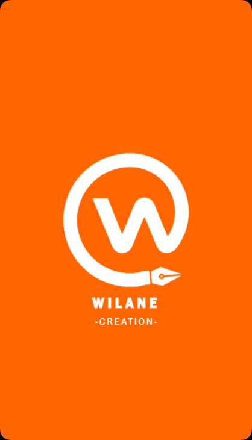
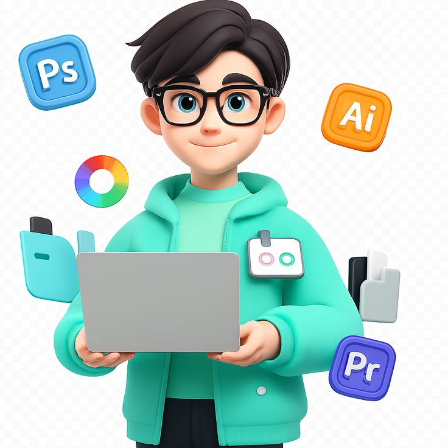

<html lang="fr">
<head>
  <meta charset="utf-8" />
  <meta name="viewport" content="width=device-width,initial-scale=1" />
  <title>Wilane Création — Formations</title>
  
</head>
<body>

  <!-- NAV -->
  <nav class="nav" aria-label="Main navigation">
    <a href="index.html">Accueil</a>
    <a href="a-propos.html">À propos</a>
    <a href="formations.html">Formations</a>
    <a href="contact.html">Contact</a>
  </nav>

  <!-- HEADER / BANNER -->
  <header id="home">
    
    <h1>Wilane Création</h1>
    
Bienvenue — Formations professionnelles en informatique, infographie et voix-off

  </header>

  <main>
    <!-- ABOUT -->
    <section id="about" class="section">
      <h2>À propos</h2>
      
Wilane Création est un centre de formation multimédia dédié à la montée en compétences : informatique (bureautique & maintenance), infographie (design, retouche) et voix-off (technique & production). Notre approche est pratique, accessible aux débutants et orientée vers l’emploi.

      
Email : <a href="mailto:wilanethiernoabdourahmane@gmail.com" class="muted">wilanethiernoabdourahmane@gmail.com</a> • WhatsApp : +221 77 541 42 27, +221 78 502 31 82

    </section>

    <!-- FORMATIONS -->
    <section id="formations" class="section" style="margin-top:20px">
      <h2>Formations</h2>
      

        <!-- Informatique -->
        

          
          <h3>Informatique — Bureautique & Maintenance</h3>
          
Word, Excel, PowerPoint, Internet et maintenance de base.

          
20 000 XOF

        

        <!-- Infographie -->
        

          
          <h3>Infographie — Photoshop & Illustrator</h3>
          
Design visuel, logos, affiches et supports marketing.

          
30 000 XOF

        

        <!-- Voix Off (image locale) -->
        

          
          <h3>Voix Off — Technique & Studio</h3>
          
Technique vocale, enregistrement, montage audio et livraison.

          
25 000 XOF

        

      

    </section>

    <!-- INSCRIPTION & PAIEMENT -->
    <section id="inscription" class="section" style="margin-top:20px">
      <h2>Inscription</h2>

      <form id="register-form">
        

          <input type="text" name="prenom" placeholder="Prénom" required>
          <input type="text" name="nom" placeholder="Nom" required>
        

        

          <input type="email" name="email" placeholder="Email" required>
          <input type="tel" name="telephone" placeholder="Téléphone (ex: +22177...)" required>
        

        

          <select name="formation" required>
            <option value="">-- Choisissez une formation --</option>
            <option value="Informatique">Informatique — 20 000 XOF</option>
            <option value="Infographie">Infographie — 30 000 XOF</option>
            <option value="Voix Off">Voix Off — 25 000 XOF</option>
          </select>

          <input type="text" name="lieu" placeholder="Lieu (ville/centre)" required>
        

        

          <select name="niveau" required>
            <option value="">-- Niveau d'études --</option>
            <option value="Aucun">Aucun</option>
            <option value="Primaire">Primaire</option>
            <option value="Secondaire">Secondaire</option>
            <option value="Bac">Bac</option>
            <option value="Licence">Licence</option>
            <option value="Master">Master</option>
            <option value="Autre">Autre</option>
          </select>

          <input type="text" name="ville" placeholder="Ville" required>
        

        

          <button type="submit" class="btn">Confirmer et envoyer</button>
          <button type="button" id="btn-pay-web" class="btn secondary">Payer via Web</button>
          <button type="button" id="btn-pay-wave" class="btn" style="background:linear-gradient(90deg,#00c0ff,#0088ff)">Payer via Wave</button>
          <button type="button" id="btn-pay-orange" class="btn" style="background:linear-gradient(90deg,#ff9a2a,#ff6b00)">Payer via Orange Money</button>
        

      </form>

      

    </section>

    <!-- CONTACT -->
    <section id="contact" class="section" style="margin-top:20px">
      <h2>Contact</h2>
      
Contactez-nous pour toute question, demande de formation sur mesure ou partenariat.

      

        

          <h3>Contact Wave</h3>
          
+221 77 541 42 27

          <!-- bouton "Message" ouvre WhatsApp avec texte pré-rempli -->
          
<a class="btn" id="wa-wave" href="#" target="_blank">Message</a>

        

        

          <h3>Contact Orange Money</h3>
          
+221 78 502 31 82

          
<a class="btn" id="wa-orange" href="#" target="_blank">Message</a>

        

      

    </section>
  </main>

  <footer>
    © 2025 Wilane Création — Tous droits réservés
  </footer>

  
</body>
</html>
